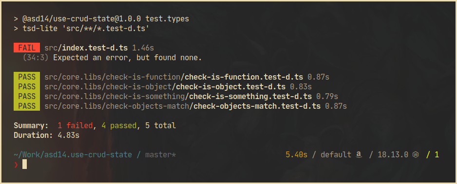

# tsd-lite-cli

> Test runner for testing TypeScript typings (CLI over [tsd-lite][intro_tsd-lite], a "per file" version of [tsd][intro_tsd]).



[intro_tsd]: https://github.com/SamVerschueren/tsd
[intro_tsd-lite]: https://github.com/mrazauskas/tsd-lite

## Table of Contents

<!-- vim-markdown-toc GFM -->

- [Install](#install)
- [Usage](#usage)
- [Example test file](#example-test-file)
- [Similar projects](#similar-projects)
- [Changelog](#changelog)

<!-- vim-markdown-toc -->

## Install

```sh
npm install -save-dev @tsd/typescript tsd-lite tsd-lite-cli
```

## Usage

```sh
npx tsd-lite 'src/**/*.test-d.ts'
```

... or add a script to your `package.json`:

```json
{
  "scripts": {
    "test.types": "tsd-lite 'src/**/*.test-d.ts'",
    ...
  }
}
```

## Example test file

```typescript
import { expectType, expectError } from "tsd-lite";
import concat from "./concat.js";

expectType<Promise<string>>(concat("foo", "bar"));
expectType<string>(await concat("foo", "bar"));
expectError(await concat(true, false));
```

For more information, see [tsd][example_tsd] for assertion syntax and [tsd-lite][example_tsd-lite].

[example_tsd]: https://github.com/SamVerschueren/tsd
[example_tsd-lite]: https://github.com/mrazauskas/tsd-lite

## Similar projects

- [jest-runner-tsd](similar_jest-runner-tsd) - Jest runner to test TypeScript typings 

[similar_jest-runner-tsd]: https://github.com/jest-community/jest-runner-tsd

## Changelog

See the [releases section](https://github.com/asd14-xyz/tsd-lite-cli/releases)
for details.
