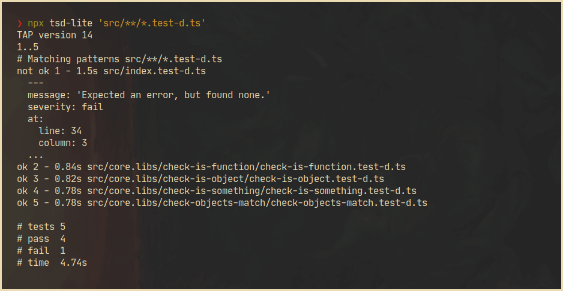
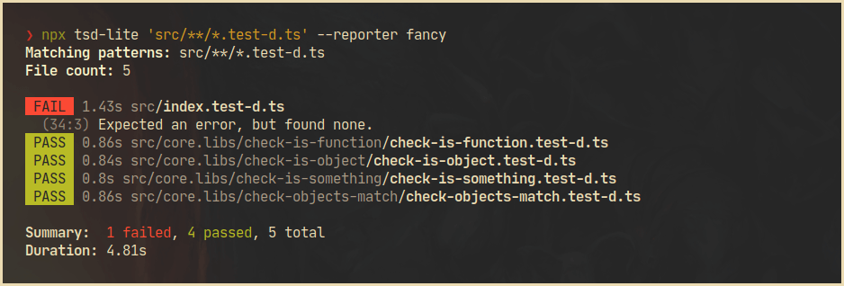

<!-- markdownlint-disable first-line-h1 -->

[](https://dl.circleci.com/status-badge/redirect/gh/asd-xiv/tsd-lite-cli/tree/main)


# tsd-lite-cli

Test runner for testing TypeScript typings (CLI over
[tsd-lite][intro_tsd-lite], a "per file" version of [tsd][intro_tsd]).

- :mag: [Glob][intro_fast-glob] pattern matching
- :white_check_mark: [TAP][intro_tap] compatible output



[intro_tsd]: https://github.com/SamVerschueren/tsd
[intro_tsd-lite]: https://github.com/mrazauskas/tsd-lite
[intro_fast-glob]: https://github.com/mrmlnc/fast-glob
[intro_tap]: https://testanything.org

## Table of Contents

<!-- vim-markdown-toc GFM -->

- [Install](#install)
- [Usage](#usage)
  - [Example typing test file](#example-typing-test-file)
- [CLI interface](#cli-interface)
  - [Reporters](#reporters)
- [Similar projects](#similar-projects)
- [Changelog](#changelog)

<!-- vim-markdown-toc -->

## Install

```shell-session
npm install --save-dev @tsd/typescript tsd-lite-cli
```

## Usage

Run `tsd-lite` with a glob pattern for matching test files (uses
[fast-glob][usage_fast-glob] internally):

```shell-session
npx tsd-lite 'src/**/*.test-d.ts'
```

[usage_fast-glob]: https://github.com/mrmlnc/fast-glob

### Example typing test file

```typescript
import { expectType, expectError } from "tsd-lite"
import concat from "./concat.js"

expectType<Promise<string>>(concat("foo", "bar"))
expectType<string>(await concat("foo", "bar"))
expectError(await concat(true, false))
```

For more information, see [tsd-lite][example_tsd-lite] for assertion syntax.

[example_tsd-lite]: https://github.com/mrazauskas/tsd-lite

## CLI interface

```console
$ npx tsd-lite --help

Usage: tsd-lite [options] <patterns...>

Test runner for testing TypeScript typings (CLI over tsd-lite, a "per file"
version of tsd)

Arguments:
  patterns               Glob patterns for matching test files

Options:
  -v, --version          Print version number
  -r, --reporter <name>  Print test results using reporter 
                         (choices: "tap", "fancy", default: "tap")
  -h, --help             Print this help guide
```

### Reporters

By default, `tsd-lite-cli` writes [Test Anything Protocol][cli_tap] compatible
output, but you can also use the `fancy` reporter, which writes a more
human-friendly output:



[cli_tap]: https://testanything.org

## Similar projects

- [jest-runner-tsd][similar_jest-runner-tsd] - Jest runner to test TypeScript
  typings

[similar_jest-runner-tsd]: https://github.com/jest-community/jest-runner-tsd

## Changelog

See the [releases section](https://github.com/asd-xiv/tsd-lite-cli/releases)
for details.
